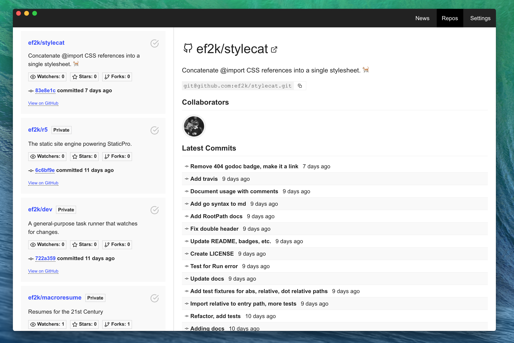

# repocmd

Quickly overview and manage GitHub repositories. Built with Electron, Vue, and Go.

## To learn how Go, Vue, and Electron can play together

See: [RepoCMD - An Adventure into Electron](https://eddieflores.com/tech/repocmd).

#### Setup

``` bash
# install dependencies
npm install

# serve using the local Go binary
npm run dev

# if running github.com/ef2k/repocmd locally, use:
npm run dev:go

```

### Weirdness I encountered

- If using pyenv, make sure `pyenv default` is python 2.x, otherwise keytar fails with a gyp error.
- If node complains about the module version for keytar, run `node_modules/.bin/electron-rebuild`.

---

This project was generated with [electron-vue](https://github.com/SimulatedGREG/electron-vue)@[7c4e3e9](https://github.com/SimulatedGREG/electron-vue/tree/7c4e3e90a772bd4c27d2dd4790f61f09bae0fcef) using [vue-cli](https://github.com/vuejs/vue-cli). Documentation about the original structure can be found [here](https://simulatedgreg.gitbooks.io/electron-vue/content/index.html).
